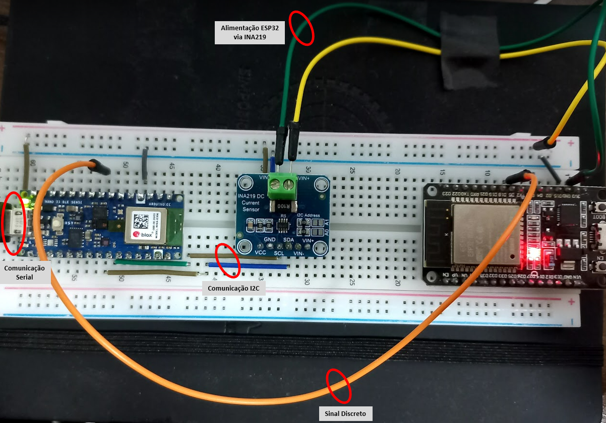

# T800: ferramenta de firewall e benchmark para IoT
---
Um filtro de pacotes inteligente para dispositivos embarcados que utilizam a Stack TCP/IPv4 LwIP.

## Pré-requisitos
Antes de executar o benchmark com o T800 no sistema da ESP32, os seguintes softwares devem estar instalados na sua máquina:
- Python3
- [Framework ESP-IDF](https://github.com/espressif/esp-idf) feito pela empresa Espressif
- *iperf v2*
- *NMap*

## Como instalar
Para nossos experimentos, o dispositivo utilizado foi a ESP32. É válido ressaltar que as portas TCP `6767`, `6768` e `5001` ***não*** podem estar sendo utilizadas pelo Sistema Operacional durante a execução dos experimentos. Caso elas estejam sendo utilizadas, essas configurações podem ser alteradas utilizando `idf.py menuconfig`.

Para instalar o componente `t800` e suas dependências no ESP-IDF do seu sistema, execute o script `install.sh`.

Para configurar a rede em que o experimento vai ser executado, entre na pasta `iperf-benchmark` e execute `idf.py menuconfig`. Altere os valores no menu `Example Connection Configuration` para a SSID e a senha da sua Wi-Fi.

Em seguida, para subir a aplicação para a ESP32, conecte-a por USB à sua maquina, então encontre a porta que ela está conectada e, por fim, execute `idf.py flash -p <PORTA_DA_ESP32>`. Execute 1 vez a aplicação, com `idf.py -p <YOUR_ESP32_PORT> monitor`, para que a ESP obtenha um IP na sua rede e finalize essa execução com `ctrl+[`.

Finalmente, para poder executar o benchmark, execute `idf.py menuconfig` e altere as configurações em `Benchmark Configuration` para incluir o IPv4 da máquina atacante e da ESP32. Então:
1. Rode `sudo python attacker.py` em uma janela de terminal
2. Rode `idf.py -p <YOUR_ESP32_PORT> flash monitor` em outra janela de terminal, em paralelo.
3. Depois de realizar o experimento, um arquivo `data.csv` será gerado com todos os dados coletados durante o experimento.

> Obs: Durante o experimento o pino D5 será 0 quando o experimento não estiver rodando e 1 durante sua execução.

## Como o T800 funciona?
O T800 necessita ser previamente configurado na própria aplicação em que se deseja utilizá-lo. Para tal, é necessário alocar uma *struct* do tipo `t800_config_t` com o modo de utilização do filtro e a função de classificação de pacotes. O modo de utilização pode ser do tipo `SELECTED` ou `UNINITIALIZED`. Já a função de classificação é dada por algum modelo do Tensorflow, convertido para o Tensorflow Lite e carregada previamente para a ESP32. É possível utilizar até mesmo um modelo mais simples com estruturas condicionais.

Em seguida, apenas é necessário chamar a função `t800_init()`, passando como argumento a *struct* de configuração. Essa função, é responsável por inicializar definitivamente o sistema do T800. 

Dessa forma, como o T800 se comunica diretamente com a stack TCP/IPv4 do LwIP, a partir do momento que pacotes começarem a chegar no dispositivo(ESP32), a função `t800_run()` é invocada. Tal função recebe como parâmetros os cabeçalhos IP e TCP do pacote que chegou na placa. Essa função, tem como propósito verificar o modo de funcionamento do T800 naquele momento e invocar a função de classificação já previamente selecionada.

## Como obter métricas computacionais?

Para nossos experimentos, foi utilizado um servidor UDP feito em python que recebe os dados da ESP32 de tempos em tempos (em nossos experimentos, foi estabelecido um tempo de 1 segundo).

É válido ressaltar que a coleta de dados é feita em uma *thread* separada da execução dos experimentos, garantindo, assim, a paralelização do experimento e da coleta dos dados.

## Como gerar um tráfego de rede na ESP32?

### Tráfego benigno
Para isso, o T800 possui um *cliente iperf* implementado de forma independente do sistema computacional do usuário que recebe os experimentos, no *servidor iperf*. Tal fato, garante que os dados coletados pelo * cliente iperf* são confiáveis e representam exatamente o que foi causado pelo experimento.

Para iniciar o * cliente iperf* na ESP32, é necessário chamar a função `iperf_tcp_server()` com um único parâmetro: o socket UDP. Dentro dessa função, o *cliente iperf* será configurado e os pacotes do *servidor iperf* serão recebidos.

Para configurar o *cliente iperf* é necessário apenas configurar o socket TCP que estabelecerá a conexão com o *servidor iperf*. Tal fato é realizado com a invocação da função `iperf_setup_tcp_server()`, passando como parâmetro uma *struct* `sockaddr_in` que servirá com o propósito de configurar o socket do *cliente iperf*.

É válido ressaltar que enquando o *cliente iperf* está rodando, outra *thread* está responsável em coletar os dados dos recursos computacionais da ESP32.

### Tráfego Malicioso

Para o controle de tráfego malicioso, dentro do script em python, que possui toda a lógica de recebimento de dados e a comunicação com o socket do *cliente iperf* da ESP32, também é executado o comando *NMap*.

O *NMap* roda conjuntamente com o *servidor iperf*, no lado do atacante(usuário que deseja receber as métricas da placa), e com o auxílio de algumas flags é possível controlar seu tráfego, como por exemplo a flag `-T`.

## O arquivo data.csv
Esse arquivo é o resultado das métricas coletadas no experimento. Nele, é importante ressaltar que as métricas mais relevantes são:

- Timestamp: identifica unicamente os pontos de dados a cada segundo.
- Mbps: identifica a velocidade da rede em um certo momento.
- wifi: identifica o tempo absoluto gasto com o processamento dos pacotes.
- Stack: identifica o uso máximo de stack em uma determinada task. 

Esse arquivo é gerado a cada execução do experimento e pode possuir inumeras replicas de um dado experimento (automatizado).

## Como obter métricas de energia?
Para obtenção das métricas de energia foi utilizado como placa a ser medida uma NodeMCU (referenciada no trabalho genericamente como ESP32) baseada no microcontrolador [ESP32-WROOM-32](https://www.espressif.com/en/products/devkits/esp32-devkitc). O sensor de corrente para medição de consumo de energia foi o [INA219](https://github.com/adafruit/Adafruit_INA219) e para leitura desse sensor, utilizou-se da comunicação I2C disponível nesse circuito integrado para leitura por uma segunda placa microcontrolada ([Nano BLE Sense 33](https://store.arduino.cc/products/arduino-nano-33-ble-sense)). Essa placa de leitura transmite os dados obtidos via I2C por comunicação serial para o computador host através de um cabo USB.

O código fonte para leitura do sensor INA219 via I2C e transmissão serial está disponível [nesse repositório](https://github.com/c2dc/t800-sbrc2022/blob/main/collected_data/pwr_measure/measure_power_nano_ble/measure_power_nano_ble.ino). A placa responsável pela leitura do sensor INA219 realiza a leitura dos seguintes parâmetros:

- Tensão (V)
- Tensão Shunt (mV)
- Tensão de Carga (V)
- Corrent (mA)
- Potência (mW)

Em adição aos 5 parâmetros disponibilizados via I2C pelo sensor de corrente INA219, também é feito a leitura do pino discreto D5 da placa ESP32. Esse pino digital é utilizado como parte do experimento para dizer quando um experimento é iniciado (indo para o nível alto) e quando ele é concluído (retornando para nível baixo). Facilitando assim a análise dos dados gerados pelos experimentos, uma vez que apenas as leituras enquando o sinal discreto está em nível alto é considerado.

Desta forma, os 6 parâmetros lidos pela placa Nano BLE Sense 33 na máxima frequência (loop infinito sem delay) é transmitido via comunicação serial com o computador host com um baudrate de 115200 bps e a mensagem no formato *comma separated values*. A leitura da comunicação serial pelo computador host é parte do script *attacker.py* (conforme o [seguinte trecho](https://github.com/c2dc/t800-sbrc2022/blob/main/collected_data/pwr_measure/attacker.py#L81-L97)).

Um esquemático da montagem do sistema de medição está disponível [aqui](./extra/sketch.fzz) e deve ser visualizado com a ferramenta [Fritzing](https://fritzing.org/). E uma imagem do setup experimental para obtenção das métricas de energia:

  

